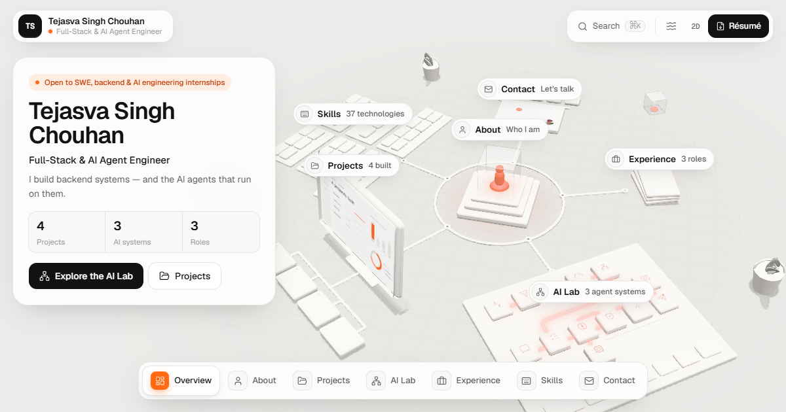

<div align="center">

# Tejasva Singh Chouhan — Interactive 3D Portfolio

**Full-Stack & AI Agent Engineer**

An interactive 3D workspace you can orbit 360°. Each module wired to the central hub opens a part of my work: projects, AI agent systems, experience, skills and contact.

### [**→ Live site: portfolio-iex3.vercel.app**](https://portfolio-iex3.vercel.app/)


<a href="https://portfolio-iex3.vercel.app/">
  
</a>

</div>

---

## Overview

Most developer portfolios are a list. This one is a **system diagram you can walk around**. An identity hub sits at the centre of a soft white board, and every part of my work is a physical module connected to it by glowing signal traces.

- **Orbit, pan and zoom** freely around the board. Clicking a module flies the camera to it and opens the details in a side panel.
- **The AI Lab** turns my agent projects into explorable node graphs. In **NeuroFlow**, switching the simulated EEG workload re-routes the LangGraph agent path live, the same way the real system does.
- **Every view has its own URL** (`/projects/hybrid-db`, `/ai/neuroflow?node=verifier`, …), so it can be shared and works with the back button.
- **All content is real HTML.** The 3D scene is the interface, not the container, so the site stays readable, accessible and indexable.

## Features

| | |
|---|---|
| **360° workspace** | Modules on a ring around the hub, each facing outward. Camera flights take the shortest route and avoid abrupt jumps. |
| **AI Lab** | Data-driven agent graphs for NeuroFlow, Traycer-mini and HTR Bench. Click any node to see its role, inputs/outputs and implementation. |
| **Crisp labels** | Text on 3D tiles is HTML pinned to each surface every frame, sized to the tile and hidden when it's too small to read or facing away. |
| **Panels & sheet** | A side panel on desktop and a draggable bottom sheet on phones hold the full write-ups. |
| **Command palette** | `⌘K` / `Ctrl+K` jumps to any project, AI system, skill or link. |
| **Keyboard first** | `1`–`6` jump to zones, `←/→` cycle items, `Esc` goes back. Tab reaches every 3D object through an accessible proxy list. |
| **2D fallback** | The full portfolio as a clean single page when WebGL is unavailable, or on request. |
| **Reduced motion** | Respects `prefers-reduced-motion`, with a manual toggle. |
| **Adaptive quality** | Device-tier detection plus a runtime performance monitor scale resolution, ambient occlusion and bloom to fit the device. |
| **SEO** | Static pre-rendered routes, per-page metadata, Open Graph/Twitter cards, JSON-LD (`Person`, `SoftwareSourceCode`), sitemap and robots. |

## Tech stack

| Area | Tools |
|---|---|
| Framework | Next.js 16 (App Router, static generation), React 19, TypeScript (strict) |
| 3D | three.js, React Three Fiber, Drei, camera-controls, maath |
| Post-processing | `@react-three/postprocessing`: N8AO ambient occlusion, selective bloom, SMAA |
| UI | Tailwind CSS 4, Geist / Geist Mono, cmdk, Lucide & Simple Icons |
| State | Zustand (one store shared by the DOM and the canvas) |
| Tooling | ESLint, sharp (image pipeline) |
| Hosting | Vercel |

## Architecture

The scene and the HTML are a **hybrid**. three.js handles space, camera, lighting and interaction; HTML handles everything you read.

```
URL (route)  ──►  view store (zustand)  ──►  camera rig flies to the module's pose
     │                    │
     ▼                    ▼
HTML panel           3D scene reacts: focus, dim, glow, pulses
(content, SEO)       DOM labels track their 3D anchors each frame
```

- **Routes drive the camera.** Navigation is ordinary Next.js routing. The canvas watches the route and animates to match, so deep links, history and crawlers all work.
- **Data-driven.** 3D components never hard-code content. Projects, AI graphs (nodes, edges, adaptive states), experience and skills live in typed data files, and the scene, panels, palette, sitemap and 2D fallback are all generated from them.
- **Performance.** On-demand rendering (the GPU idles when nothing moves), a single icon/label texture atlas, shared geometries and lazy-loaded 3D. three.js is not in the initial bundle.

```
src/
├── app/          routes, metadata, sitemap, OG image
├── components/   UI primitives, top bar, dock, command palette, panels
├── sections/     content views, shared by panels and the 2D fallback
├── three/        scene, camera rig, layout, objects/, labels, atlas
├── data/         all portfolio content (typed)
├── lib/          routing ↔ view state, graph routing, icons, device tier
└── store/        zustand view store
```

## Getting started

Requires **Node.js 20.9+**.

```bash
git clone https://github.com/tejasvasingh2004/Portfolio.git
cd Portfolio
npm install
npm run dev          # http://localhost:3000
```

| Script | Purpose |
|---|---|
| `npm run dev` | Development server |
| `npm run build` | Production build (all routes pre-rendered) |
| `npm start` | Serve the production build |
| `npm run lint` | ESLint |
| `npm run typecheck` | TypeScript check |
| `npm run optimize-images` | Convert raw images in `intake/` to WebP/AVIF in `public/assets/` |

**Testing helpers:** `?tier=high|medium|low` forces a device tier, and `?fx=ao,bloom` limits post-processing.

## Updating content

All content lives in **`src/data/`**. Change it there and the whole site follows.

| File | Holds |
|---|---|
| `profile.ts` | Name, title, bio, status, links, education |
| `projects.ts` | Projects: problem, solution, decisions, stack, links, key facts |
| `aiSystems.ts` | AI Lab graphs: nodes (grid positions), edges, adaptive states |
| `experience.ts` | Roles, newest first |
| `skills.ts` | Skills by cluster. "Where I used it" is derived automatically |

Adding a project to `projects.ts` creates its 3D card, monitor screen, `/projects/<slug>` page, palette entry and sitemap entry.

## Deployment

The site is fully static, with no server code, database or secrets, so it deploys free on Vercel:

1. Import the repository on [vercel.com](https://vercel.com) and keep the default Next.js settings.
2. Every push to `master` deploys to production. Other branches get preview URLs.
3. *Optional:* for a custom domain, set `NEXT_PUBLIC_SITE_URL` (see `.env.example`). Otherwise the production `*.vercel.app` URL is used for canonical links, the sitemap and social cards.

Netlify and Cloudflare Pages work too: use the Next.js preset and `npm run build`.

## Contact

**Tejasva Singh Chouhan**, B.Tech Computer Engineering, SGSITS Indore

[Portfolio](https://portfolio-iex3.vercel.app/) · [GitHub](https://github.com/tejasvasingh2004) · [LinkedIn](https://www.linkedin.com/in/tejasva-singh-chouhan-859bab31a) · [LeetCode](https://leetcode.com/u/tejasvasingh44/) · [tejasva12112004@gmail.com](mailto:tejasva12112004@gmail.com)

<sub>The design brief and full specification are in [`portfolio_3d_spec.md`](portfolio_3d_spec.md).</sub>
